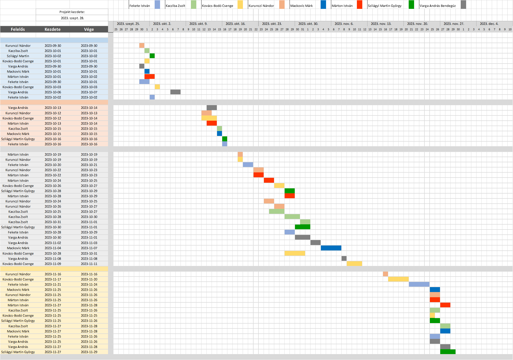

# `Webshop` Projektterv `2023`

## 1. Összefoglaló 

`Az áruvásárlás élményének javítása és a felhasználók számára kényelmes megoldások biztosítása a fő célunk ebben a projektben. Webshopunk lehetővé teszi a vásárlók számára, hogy gyorsan és egyszerűen böngésszenek, vásároljanak, értékeljenek termékeket, valamint saját áruikat is feltehessék az oldalra. Egy felhasználóbarát felülettel és rugalmas funkciókkal segítünk megteremteni a zökkenőmentes online vásárlási élményt.`

## 2. A projekt bemutatása

`Ez a projektterv a Webshop projektet mutatja be, amely 2023-09-28-től 2023-12-06-ig tart, azaz összesen 70 napon keresztül fog futni. A projekten nyolc fejlesztő fog dolgozni, az elvégzett feladatokat pedig négy alkalommal fogjuk prezentálni a megrendelőnek, annak érdekében, hogy biztosítsuk a projekt folyamatos előrehaladását.`

### 2.1. Rendszerspecifikáció

`A webes alkalmazás képes lesz regisztrált felhasználók vásárlásinak lebonyolítására, ezeknek a tranzakcióknak a visszatekintésére később. A vásárlók értékelhetik a termékeket kommentekben és egy 5 pontos értékelő rendszerben is, mely értékelés látható lesz a termék oldalán minden későbbi vásárló számára. Felhansználók kereshetnek termékeket tag-ek alapján, a keresőt használva, vagy szimplán a kezdőoldalt böngészve. Eladó jogosultságú felhasználók tudnak hirdetéseket létrehozni saját termékeiknek, megadhatják mennyi termék van készleten, és elláthatják termékeiket tag-ekkel. Eladók a saját hirdetéseiket bármikor szerkezthetik és törölhetik, illetve a termékére adott értékeléseket moderálhatják. A adminisztrátor jogosultsággal bármilyen a weboldalon szereplő termék hirdetést ki lehet törölni, illetve az összes kommentet lehet moderálni, és az árukészleteket is lehet kezelni.`

### 2.2. Funkcionális követelmények

 - `Felhasználói munkamenet megvalósítása több jogosultsági szinttel `
 - `Felhasználók kezelése (Regisztráció/Belépés)`
 - `Fizetési funkciók. (CRUD)`
 - `Előző vásárlások megtekintése` 
 - `Termékek értékelése (Comment+Rating) (CRUD)`
 - `Termékek értékelésének kezelése (CRUD)`
 - `Kosár funkció`
 - `Tagek alapú keresés`
 - `Termék Név/Leírás/Tag alapú keresés (Kereső sáv)`
 - `Felhasználói adatok frissítése`
 - `Admin: Árukészletek kezelése (CRUD)`
 - `Admin: Tagek kezelése (CRUD)`
 - `Admin: Felhasználók kezelése (CRUD)`

### 2.3. Nem funkcionális követelmények

 - `A kliens oldal böngészőfüggetlen legyen`
 - `Reszponzív megjelenés`
 - `Az érzékeny adatokat biztonságosan tároljuk`
 - `A legfrissebb technológiákat használja a rendszer`

## 3. Költség- és erőforrás-szükségletek
Az erőforrásigényünk összesen `87` személynap, átlagosan `11` személynap/fő.
A rendelkezésünkre áll összesen `8 * 70 = 560` pont.
## 4. Szervezeti felépítés és felelősségmegosztás
A projekt megrendelője Dr. Pflanzner Tamás. A Webshop projektet a projektcsapat fogja végrehajtani, amely `jelenleg nyolc fejlesztőből áll. A csapatban található tapasztalt és pályakezdő webprogramozó is, A tapasztalt projekttag több éve dolgozik az iparban.

- `Fekete István: nem rendelkezik ipari tapasztalattal`
- `Kacziba Zsolt: nem rendelkezik ipari tapasztalattal`
- `Kovács-Bodó Csenge: 5 hónap full stack szoftverfelesztés( spring boot, node.js, angular, tesztelés, postgres adatbáziskezelés)`
- `Kurunczi Nándor: nem rendelkezik ipari tapasztalattal`
- `Mackovic Mark: nem rendelkezik ipari tapasztalattal`
- `Márton István: nem rendelkezik ipari tapasztalattal`
- `Szilágyi Martin György: nem rendelkezik ipari tapasztalattal`
- `Varga András Bendegúz: nem rendelkezik ipari tapasztalattal`
### 4.1 Projektcsapat
A projekt a következő emberekből áll:
| Név                    | Pozíció          | E-mail cím (stud-os)     |
|------------------------|------------------|--------------------------|
| Fekete István          | Projekt tag      | h157500@stud.u-szeged.hu |
| Kacziba Zsolt          | Projekt tag      | h159351@stud.u-szeged.hu |
| Kovács-Bodó Csenge     | Projekt tag      | h160431@stud.u-szeged.hu |
| Kurunczi Nándor        | Projektmenedzser | h160624@stud.u-szeged.hu |
| Mackovic Mark          | Projekt tag      | h161221@stud.u-szeged.hu |
| Márton István          | Projekt tag      | h161882@stud.u-szeged.hu |
| Szilágyi Martin György | Projekt tag      | h269583@stud.u-szeged.hu |
| Varga András Bendegúz  | Projekt tag      | h270432@stud.u-szeged.hu |
## 5. A munka feltételei

### 5.1. Munkakörnyezet

A projekt a következő munkaállomásokat fogja használni a munka során:

- `Munkaállomások: 8 db, Windows 10-es operációs rendszerrel`
- `ASUS TUF Gaming F17 2021(CPU: i5 11400H, RAM: 8 GB, GPU: Nvidia GeForce RTX 3050Ti)`
- `Laptop(CPU: i7 8700, RAM: 32 GB, GPU: Nvidia GTX 1080)`
- `Asztali számítógép(CPU: Ryzen 3 2200G, RAM:16GB, GPU: GTX1050Ti)`
- `Asztali számítógép(CPU: i7-3770, RAM:16GB, GPU: GTX1050Ti)`
- `Laptop(CPU: i7-9750H, RAM: 16GB, GPU: GTX 1650)`
- `Laptop(CPU: i5-8250U, RAM: 12GB, GPU: GTX1050)`
- `Asztali számítógép (CPU: Ryzen 3 1200, RAM:32GB, GPU: GTX1050Ti)`
- `Asztali számítógép (CPU: Intel  i7-7700 ,Ram: 16, GPU: GTX1060Ti)`

A projekt a következő technológiákat/szoftvereket fogja használni a munka során:

- `Google Firebase az alkalmazás üzemeltetésére`
- `Angular dinamikus tartalom megjelenítés a felhasználói felületen`
- `IntelliJ IDE fejlesztőkörnyezet`
- `Git verziókövető (GitLab)`

### 5.2. Rizikómenedzsment

| Kockázat                                    | Leírás                                                                                                                                                                                                                 | Valószínűség | Hatás  | 
|---------------------------------------------|------------------------------------------------------------------------------------------------------------------------------------------------------------------------------------------------------------------------|--------------|--------|
| `Betegség`                                  | `Súlyosságtól függően hátráltatja vagy bizonyos esetekben teljes mértékben korlátozza a munkavégzőt, így az egész projektre kihatással van. Megoldás: a feladatok átcsoportosítása.`                                   | `nagy`       | `erős` | 
| `Kommunikációs fennakadás a csapattagokkal` | `A csapattagok között nem elégséges az információ áramlás, nem pontosan, esetleg késve vagy nem egyértelműen tájékoztatjuk egymást. Megoldás: még gyakoribb megbeszélések és ellenőrzések.`                            | `kis`        | `erős` |
| `Fejlesztői program hiba`                   | `A használt szoftvereket valamilyen hiba miatt nem tudja a hallgató haszmálni. Megoldás: szoftver újratelepítése, más hallgatótól segítség kérése.`                                                                    | `közepes`    | `erős` |
| `Nehéz feladat`                             | `A hallgató elakad a feladatban, mert nem érti, vagy nem tudja a megoldást. Megoldás: segítségkérés a csapattársaktól.`                                                                                                | `nagy`       | `erős` |
| `Nem megfelelő időmenedzsment`              | `A projekt időbeosztása nem megfelelően lett definiálva, ezért túrterheltség, határidők betartásásnak a hiánya lép fel. Megoldás: az időbeosztás rugalmasan kell megtervezni, érdemes rövidtávú célokat meghatározni.` | `közepes`    | `erős` |


## 6. Jelentések

### 6.1. Munka menedzsment

A munkát `Kurunczi Nándor` koordinálja. 

`Az általános feladatai mellett a projekt menedzselésének felelőssége is rá hárul.`

`Projekt menedzser feladatai:`
- `Feladatok kiosztása, áthelyezése`
- `Projekttel kapcsolatos felmerülő problémák megoldása`
- `Követelménymenedzsment`
- `Minőségbiztosítás koordinálása`


### 6.2. Csoportgyűlések

`A projekt csapat hetente tart megbeszélést. Megbeszélik a héten elkészült feladatokat, majd a jövő hét feladatait, valamint az esetleg felmerülő problémákat. Minden megbeszélést előre leegyeztetett időpontban bonyolítják le.`

`1. megbeszélés:`
 - `Időpont: 2023.09.28.`
 - `Hely: Otthon online - Erefegy discord szerver`
 - `Résztvevők: Fekete István, Kacziba Zsolt, Kovács-Bodó Csenge, Kurunczi Nándor, Mackovic Márk, Márton István, Szilágyi Martin György, Varga András Bendegúz`
 - `Érintett témák: Ismerkedés, projektben használt technológiák kiválasztása, projektterv megírás feladatrészek szétosztása`

`2. megbeszélés:`
 - `Időpont: 2023.10.05.`
 - `Hely: Otthon online - Erefegy discord szerver`
 - `Résztvevők: Fekete István, Kacziba Zsolt, Kovács-Bodó Csenge, Kurunczi Nándor, Mackovic Márk, Márton István, Szilágyi Martin György, Varga András Bendegúz`
 - `Érintett témák: Git repo konvenciók, fejlesztési modell kiválasztása, első mérföldkő haladásának megbeszélése, második mérföldkő feladatainak megbeszélése`
 
`3. megbeszélés:`
 - `Időpont: 2023.10.10.`
 - `Hely: Otthon online - Erefegy discord szerver`
 - `Résztvevők: Fekete István, Kacziba Zsolt, Kovács-Bodó Csenge, Kurunczi Nándor, Mackovic Márk, Márton István, Szilágyi Martin György, Varga András Bendegúz`
 - `Érintett témák: Projektterv 8.3-4 pontok megbeszélése, feladatok szétosztása`

`4. megbeszélés:`
 - `Időpont: 2023.10.12.`
 - `Hely: Otthon online - Erefegy discord szerver`
 - `Résztvevők: Fekete István, Kacziba Zsolt, Kovács-Bodó Csenge, Kurunczi Nándor, Mackovic Márk, Márton István, Szilágyi Martin György, Varga András Bendegúz`
 - `Érintett témák: Projektterv költség és erőforrás szükségletek, és egyéb hiányosságok átbeszélése`

`5. megbeszélés:`
 - `Időpont: 2023.10.19.`
 - `Hely: Otthon online - Erefegy discord szerver`
 - `Résztvevők: Fekete István, Kacziba Zsolt, Kovács-Bodó Csenge, Kurunczi Nándor, Mackovic Márk, Márton István, Szilágyi Martin György, Varga András Bendegúz`
 - `Érintett témák: Projektterv hiányosságok, következő feladatok megbeszélése`


`6. megbeszélés:`
 - `Időpont: 2023.10.26.`
 - `Hely: Otthon online - Erefegy discord szerver`
 - `Résztvevők: Fekete István, Kacziba Zsolt, Kovács-Bodó Csenge, Kurunczi Nándor, Mackovic Márk, Márton István, Szilágyi Martin György, Varga András Bendegúz`
 - `Érintett témák: Szekvencia diagram feladatok szétosztása`


`7. megbeszélés:`
 - `Időpont: 2023.10.31.`
 - `Hely: Otthon online - Erefegy discord szerver`
 - `Résztvevők: Fekete István, Kacziba Zsolt, Kovács-Bodó Csenge, Kurunczi Nándor, Mackovic Márk, Márton István, Szilágyi Martin György, Varga András Bendegúz`
 - `Érintett témák: Diagramok véglegesítése, projekt követelmények átbeszélése`

`8. megbeszélés:`
 - `Időpont: 2023.11.02.`
 - `Hely: Otthon online - Erefegy discord szerver`
 - `Résztvevők: Fekete István, Kacziba Zsolt, Kovács-Bodó Csenge, Kurunczi Nándor, Mackovic Márk, Márton István, Szilágyi Martin György
 - `Érintett témák: Harmadik mérföldkő feladatainak megbeszélése, firebase projekt létrehozása`

`9. megbeszélés:`
 - `Időpont: 2023.11.10.`
 - `Hely: Otthon online - Erefegy discord szerver`
 - `Résztvevők: Fekete István, Kacziba Zsolt, Kovács-Bodó Csenge, Kurunczi Nándor, Mackovic Márk, Márton István, Szilágyi Martin György, Varga András Bendegúz`
 - `Érintett témák: Projekt feladatok haldásának megbeszélése, eetleges elakadt feladatokkal segítség nyújtás`

`10. megbeszélés:`
 - `Időpont: 2023.11.16.`
 - `Hely: Otthon online - Erefegy discord szerver`
 - `Résztvevők: Fekete István, Kacziba Zsolt, Kovács-Bodó Csenge, Kurunczi Nándor, Mackovic Márk, Márton István, Szilágyi Martin György, Varga András Bendegúz`
 - `Érintett témák: Egymás feladatainak átnézése, jóváhagyása, firebase adatbáziskezelés áttekintése`

`11. megbeszélés:`
 - `Időpont: 2023.11.21.`
 - `Hely: Otthon online - Erefegy discord szerver`
 - `Résztvevők: Fekete István, Kacziba Zsolt, Kovács-Bodó Csenge, Kurunczi Nándor, Mackovic Márk, Márton István, Szilágyi Martin György, Varga András Bendegúz`
 - `Érintett témák: Kimaradt funkciók felmérése, szétosztása`

`12. megbeszélés:`
 - `Időpont: 2023.11.22.`
 - `Hely: Otthon online - Erefegy discord szerver`
 - `Résztvevők: Fekete István, Kacziba Zsolt, Kovács-Bodó Csenge, Kurunczi Nándor, Mackovic Márk, Márton István, Szilágyi Martin György, Varga András Bendegúz`
 - `Érintett témák: Feladatok haladásának áttekintése, egymásnak segítségnyújtás`
### 6.3. Minőségbiztosítás

`A projekt komponensenkénti megtervezése specifikáció szerint, majd az így elkészült tervek és diagramok több ember általi átnézése. Elkészült kódrészletek és komponens prototípusok több ember általi átnézése olyan csapattagok által, akik a tesztelni kívánt részen nem dolgoztak. Az alkalmazás elkészült részeinek követelményeknek való megfeleltségének ellenőrzése.`

- `Specifikáció és tervek ismerete, betartása`
- `Code review`

### 6.4. Átadás, eredmények elfogadása

A projekt eredményeit a megrendelő, `Dr. Pflanzner Tamás` fogja elfogadni. A projektterven változásokat csak a megrendelő írásos engedélyével lehet tenni. A projekt eredményesnek bizonyul, ha specifikáció helyes és határidőn belül készül el. Az esetleges késések pontlevonást eredményeznek.
Az elfogadás feltételeire és beadás formájára vonatkozó részletes leírás a következő honlapon olvasható: https://okt.inf.szte.hu/rf1/

### 6.5. Státuszjelentés

Minden mérföldkő leadásnál a projekten dolgozók jelentést tesznek a mérföldkőben végzett munkájukról a megadott sablon alapján. A gyakorlatvezetővel folytatott csapatmegbeszéléseken a csapat áttekintik és felmérik az eredményeket és teendőket. Továbbá gazdálkodnak az erőforrásokkal és szükség esetén a megrendelővel egyeztetnek a projektterv módosításáról.

## 7. A munka tartalma
### 7.1. Tervezett szoftverfolyamat modell és architektúra

Csapatunk az agilis szoftverfejlesztési módszertant alkalmazza a projekt során. Az agilis megközelítés lehetővé teszi számunkra, hogy gyorsan reagáljunk a változó igényekre. Folyamatosan kommunikálunk a csapattagok között, hogy biztosítsuk a projektfolyamat gördülékenységét és sikerét.

A webalkalmazásunk egy modern MVC (Modell-View-Controller) architektúrát követ. Ez a felépítés hatékonyan szervezi meg a kódunkat, és segít elkülöníteni a különböző feladatokat a rendszerünkben. A "Modell" réteg felelős az üzleti logika és az adatelérés megvalósításáért. A "View" réteg a felhasználói felületet kezeli és jeleníti meg, míg a "Controller" réteg vezérli a felhasználói interakciókat és irányítja a működést.

### 7.2. Átadandók és határidők

A főbb átadandók és határidők a projekt időtartama alatt a következők:


| Szállítandó |                 Neve                                                        |    Határideje   |
|:-----------:|:---------------------------------------------------------------------------:|:---------------:|
|      D1     |      Projektterv, Gantt diagram, egyéni jelentés                            | **2023-10-11**  |
|      D2     |      UML, adatbázistervek, képernyőtervek, egyéni jelentés                  | **2023-10-25**  |
|    P1+D3    |      Prototípus I. és tesztelési dokumentáció                               | **2023-11-15**  |
|    P2+D4    |      Prototípus II. és frissített tesztelési dokumentáció, egyéni jelentés  | **2023-12-06**  |

```
D - dokumentáció, P - prototípus
```


## 8. Feladatlista

### 8.1. Projektterv (1. mérföldkő)
Ennek a feladatnak az a célja, hogy megvalósításhoz szükséges lépéseket, az ütemezést és a felelősöket meghatározzuk, felelőiség köröket felosszuk.
Részfeladatai a következők:

#### 8.1.1. Projektterv 1-2. pontjának kitöltése
Felelős: Kurunczi Nándor
Tartam:  1 nap
Erőforrásigény:  1 személynap

#### 8.1.2. Projektterv 2.2-2.3. pontjának kitöltése
Felelős: Kacziba Zsolt
Tartam:  1 nap
Erőforrásigény:  1 személynap

#### 8.1.3. Projektterv 3-4. pontjának kitöltése
Felelős: Szilágyi Martin
Tartam:  1 nap
Erőforrásigény:  1 személynap

#### 8.1.4. Projektterv 5. pontjának kitöltése
Felelős: Kovács-Bodó Csenge
Tartam:  1 nap
Erőforrásigény:  1 személynap

#### 8.1.5. Projektterv 6. pontjának kitöltése
Felelős: Varga András
Tartam:  1 nap
Erőforrásigény:  1 személynap

#### 8.1.6. Projektterv 7. pontjának kitöltése
Felelős: Mackovic Mark
Tartam:  1 nap
Erőforrásigény:  1 személynap

#### 8.1.7. Projektterv 8.1-8.2. pontjának kitöltése
Felelős: Márton István
Tartam:  2 nap
Erőforrásigény:  1 személynap

#### 8.1.8. Projektterv 8.3-8.4. pontjának kitöltése
Felelős: Fekete István
Tartam:  2 nap
Erőforrásigény:  1 személynap

#### 8.1.9. Projektterv 9. pontjának kitöltése
Felelős: Kovács-Bodó Csenge
Tartam:  1 nap
Erőforrásigény:  1 személynap

#### 8.1.10. Gant diagram elkészítése
Felelős: Varga András
Tartam:  2 nap
Erőforrásigény:  2 személynap

#### 8.1.11. Projektterv 10. pontjának kitöltése
Felelős: Márton István
Tartam:  1 nap
Erőforrásigény:  1 személynap

#### 8.2. UML és adatbázis tervek (2. mérföldkő)
Ennek a feladatnak az a célja, hogy a rendszerarchitektúrát, az adatbázist és webalkalmazás kinézetét megtervezzük.
Részfeladatai a következők:

#### 8.2.1 Use Case diagram elkészítése
Felelős: Varga András
Tartam: 2 nap
Erőforrásigény: 2 személynap

#### 8.2.2 Rendszerarchitektúra tervezése
Felelős: Kuruczi Nándor
Tartam: 2 nap
Erőforrásigény: 2 személynap

#### 8.2.3 Adatbázis tervek kidolgozása
Felelős: Kovács-Bodó Csenge
Tartam: 3 nap
Erőforrásigény: 2 személynap

#### 8.2.4 Képernyőtervek készítése
Felelős: Márton István
Tartam: 2 nap
Erőforrásigény: 2 személynap

#### 8.2.5 Use Case diagram jóváhagyása és véglegesítése, Class diagram készítése
Felelős: Kacziba Zsolt
Tartam: 1 nap
Erőforrásigény: 1 személynap

#### 8.2.6 Rendszerarchitektúra terve jóváhagyása és véglegesítése, Sequence diagram készítése
Felelős: Mackovic Márk 
Tartam: 1 nap
Erőforrásigény: 1 személynap

#### 8.2.7 Adatbázis tervek jóváhagyása és véglegesítése, E-K diagram készítése
Felelős: Szilágyi Martin György
Tartam: 1 nap
Erőforrásigény: 1 személynap

#### 8.2.8 Képernyőtervek jóváhagyása és véglegesítése, Package diagram készítése
Felelős: Fekete István
Tartam: 1 nap
Erőforrásigény: 1 személynap

### 8.3 Prototípus I. (3. mérföldkő)

Ennek a feladatnak az a célja, hogy egy működő prototípust hozzunk létre, ahol a vállalt funkcionális követelmények nagy része már prezentálható állapotban van.
Részfeladatai a következők:

#### 8.3.1 Alap projekt fájlok létrehozása
Felelős: Márton István
Tartam: 1 nap
Erőforrásigény: 1 személynap
#### 8.3.2 Modellek megvalósításának jóváhagyása
Felelős: Kurunczi Nándor
Tartam: 1 nap
Erőforrásigény: 1 személynap
#### 8.3.3 Navigációs sáv
Felelős: Fekete István
Tartam: 2 nap
Erőforrásigény: 1 személynap
#### 8.3.4 Login/Regisztráció oldal létrehozása
Felelős: Kurunczi Nándor
Tartam: 2 nap
Erőforrásigény: 1 személynap
#### 8.3.5 Login/Regisztráció oldal backend (CR)
Felelős: Márton István
Tartam: 2 nap
Erőforrásigény: 2 személynap
#### 8.3.6 Főoldal létrehozása 
Felelős: Márton István
Tartam: 2 nap
Erőforrásigény: 2 személynap
#### 8.3.7 Főoldal: Termékek listázása (R)
Felelős: Kovács-Bodó Csenge
Tartam: 2 nap
Erőforrásigény: 2 személynap
#### 8.3.8 Főoldal: Tag keresés (R)
Felelős: Szilágyi Martin
Tartam: 2 nap
Erőforrásigény: 2 személynap
#### 8.3.9 Főoldal: Keresősáv megvalósítása (R)
Felelős: Márton István
Tartam: 2 nap
Erőforrásigény: 2 személynap
#### 8.3.10 Fiók: Felhasználói adatok módosítása (U)
Felelős: Kurunczi Nándor
Tartam: 2 nap
Erőforrásigény: 2 személynap
#### 8.3.11 Fiók: Megrendelések listázása (R)
Felelős: Kurunczi Nándor
Tartam: 2 nap
Erőforrásigény: 2 személynap
#### 8.3.12 Kosár oldal létrehozása (cookie)
Felelős: Kacziba Zsolt
Tartam: 3 nap
Erőforrásigény: 2 személynap
#### 8.3.13 Kosár: Tartalom módosítása (CD)
Felelős: Kacziba Zsolt
Tartam: 2 nap
Erőforrásigény: 1 személynap
#### 8.3.14 Kosár: Rendelés leadása
Felelős: Kacziba Zsolt
Tartam: 2 nap
Erőforrásigény: 1 személynap
#### 8.3.15 Termék oldal létrehozása + Kommentek (R)
Felelős: Szilágyi Martin
Tartam: 3 nap
Erőforrásigény: 3 személynap
#### 8.3.16 Termék: Kosárba helyezés (cookie, C)
Felelős: Fekete István
Tartam: 3 nap
Erőforrásigény: 2 személynap
#### 8.3.17 Termék: Kommentek megvalósítása (CRUD)
Felelős: Varga András Bendegúz
Tartam: 3 nap
Erőforrásigény: 2 személynap
#### 8.3.18 Termék: Kommentek kezelése (Admin) (UD)
Felelős: Varga András Bendegúz
Tartam: 2 nap
Erőforrásigény: 2 személynap
#### 8.3.19 Admin: Listázások (Felhasználó/Termék/Tag) (R)
Felelős: Mackovic Márk
Tartam: 5 nap
Erőforrásigény: 5 személynap
#### 8.3.20 Admin: Táblák backend (CRUD)
Felelős: Kovács-Bodó Csenge
Tartam: 4 nap
Erőforrásigény: 4 személynap
#### 8.3.21 Deploy
Felelős: Varga András Bendegúz
Tartam: 1 nap
Erőforrásigény: 1 személynap
#### 8.3.22 Firestore adatbázis teltöltés
Felelős: Kovács-Bodó Csenge
Tartam: 3 nap
Erőforrásigény: 3 személynap

### 8.4 Prototípus II. (4. mérföldkő)

Ennek a feladatnak az a célja, hogy az előző mérföldkő hiányzó funkcióit pótoljuk, illetve a hibásan működő funkciókat és az esetlegesen felmerülő új funkciókat megvalósítsuk. Továbbá az alkalmazás alapos tesztelése is a mérföldkőben történik az előző mérföldkőben összeállított tesztesetek alapján.

Részfeladatai a következők:

#### 8.4.1 Meglévő funkciók összevetése a funkciók listájával
Felelős: Kuruczi Nándor
Tartam: 1 nap
Erőforrásigény: 1 személynap
#### 8.4.2 Projektterv, programdokumentációk karbantartása
Felelős: Kovács-Bodó Csenge
Tartam: 2 nap
Erőforrásigény: 1 személynap
#### 8.4.3 Nem elvárásoknak megfelelően működő funkciók javítása
Felelős: Fekete István
Tartam: 4 nap
Erőforrásigény: 3 személynap
#### 8.4.4 Regisztráció tesztelése
Felelős: Mackovic Márk
Tartam: 2 nap
Erőforrásigény: 1 személynap
#### 8.4.5 Login tesztelése
Felelős: Kuruczi Nándor
Tartam: 2 nap
Erőforrásigény: 1 személynap
#### 8.4.6 Kosárba helyezés tesztelése
Felelős: Márton István
Tartam: 2 nap
Erőforrásigény: 1 személynap
#### 8.4.7 Megrendelés tesztelése
Felelős: Márton István
Tartam: 2 nap
Erőforrásigény: 1 személynap
#### 8.4.8 Felhasználó adatainak szerkesztésének tesztelése
Felelős: Kacziba Zsolt
Tartam: 2 nap
Erőforrásigény: 1 személynap 
#### 8.4.9 Admin: Felhasználó szerepkörének módosításának tesztelése
Felelős: Kovács-Bodó Csenge
Tartam: 1 nap
Erőforrásigény: 1 személynap
#### 8.4.10 Admin: Felhasználó törlésének tesztelése
Felelős: Szilágyi Martin György
Tartam: 2 nap
Erőforrásigény: 1 személynap
#### 8.4.11 Komment létrehozásának tesztelése
Felelős: Kacziba Zsolt
Tartam: 2 nap
Erőforrásigény: 1 személynap
#### 8.4.12 Komment törlésének tesztelése
Felelős: Mackovic Márk
Tartam: 2 nap
Erőforrásigény: 1 személynap
#### 8.4.13 Termék hozzáadás tesztelése
Felelős: Fekete István
Tartam: 2 nap
Erőforrásigény: 1 személynap
#### 8.4.14 Termék módosítás tesztelése
Felelős: Varga András Bendegúz
Tartam: 2 nap
Erőforrásigény: 1 személynap
#### 8.4.15 Termék törlés tesztelése
Felelős: Varga András Bendegúz
Tartam: 2 nap
Erőforrásigény: 1 személynap
#### 8.4.16 Adatbázis tesztelése
Felelős: Szilágyi Martin György
Tartam: 3 nap
Erőforrásigény: 2 személynap 
#### 8.4.17 Customer delete gomb fix
Felelős: Kovács-bodó Csenge
Tartam: 2 nap
Erőforrásigény: 1 személynap 

## 9. Részletes időbeosztás


## 10. Projekt költségvetés

### 10.1. Részletes erőforrásigény (személynap)


| Név          |   M1  |   M2  |   M3 |   M4  | Összesen |
|--------------|-------|-------|------|-------|----------|
| Fekete István          | 1 | 1 | 6 | 4 | 12 |
| Kacziba Zsolt          | 1 | 1 | 5 | 2 | 9 |
| Kovács-Bodó Csenge     | 2 | 2 | 5 | 4 | 13 |
| Kurunczi Nándor        | 1 | 2 | 5 | 2 | 10 |
| Mackovic Mark          | 1 | 1 | 5 | 2 | 9 |
| Márton István          | 2 | 2 | 6 | 2 | 12 |
| Szilágyi Martin György | 1 | 1 | 5 | 3 | 10 |
| Varga András Bendegúz  | 3 | 2 | 5 | 2 | 12 |


### 10.2. Részletes feladatszámok

| Név          |   M1  |   M2  |   M3 |   M4  | Összesen |
|--------------|-------|-------|------|-------|----------|
| Fekete István          | 1 | 1 | 3 | 2 | 7 |
| Kacziba Zsolt          | 1 | 1 | 3 | 2 | 7 |
| Kovács-Bodó Csenge     | 2 | 1 | 3 | 2 | 8 |
| Kurunczi Nándor        | 1 | 1 | 3 | 2 | 7 |
| Mackovic Mark          | 1 | 1 | 2 | 2 | 6 |
| Márton István          | 2 | 1 | 3 | 2 | 8 |
| Szilágyi Martin György | 1 | 1 | 2 | 2 | 6 |
| Varga András Bendegúz  | 2 | 1 | 3 | 2 | 8 |

### 10.3. Részletes költségvetés

| Név                            | M1  | M2   | M3   | M4   | Összesen  |
|--------------------------------|-----|------|------|------|-----------|
| Maximálisan megszerezhető pont | (7) | (28) | (35) | (28) | 100% (70) |
| Fekete István                  | 5   | 20   | 23   | 22   | 70        |
| Kacziba Zsolt                  | 6   | 20   | 23   | 21   | 70        |
| Kovács-Bodó Csenge             | 7   | 20   | 22   | 21   | 70        |
| Kurunczi Nándor                | 7   | 22   | 22   | 19   | 70        |
| Mackovic Mark                  | 6   | 20   | 20   | 24   | 70        |
| Márton István                  | 7   | 22   | 23   | 18   | 70        |
| Szilágyi Martin György         | 6   | 20   | 24   | 20   | 70        |
| Varga András Bendegúz          | 7   | 21   | 21   | 21   | 70        |

Szeged, `2023-10-11`.
